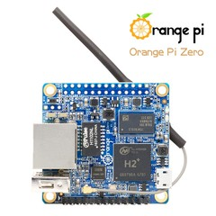

# orange-pi-zero-kernel

linux kernel 3.4.113-sun8i OrangePi Zero

based and adaptated on kernel from https://github.com/igorpecovnik/lib

## build
building scripts configs and kernel source

## compiled
compiled kernel and modules

## dl 
toolchain gcc and other utils for kerlnel building
